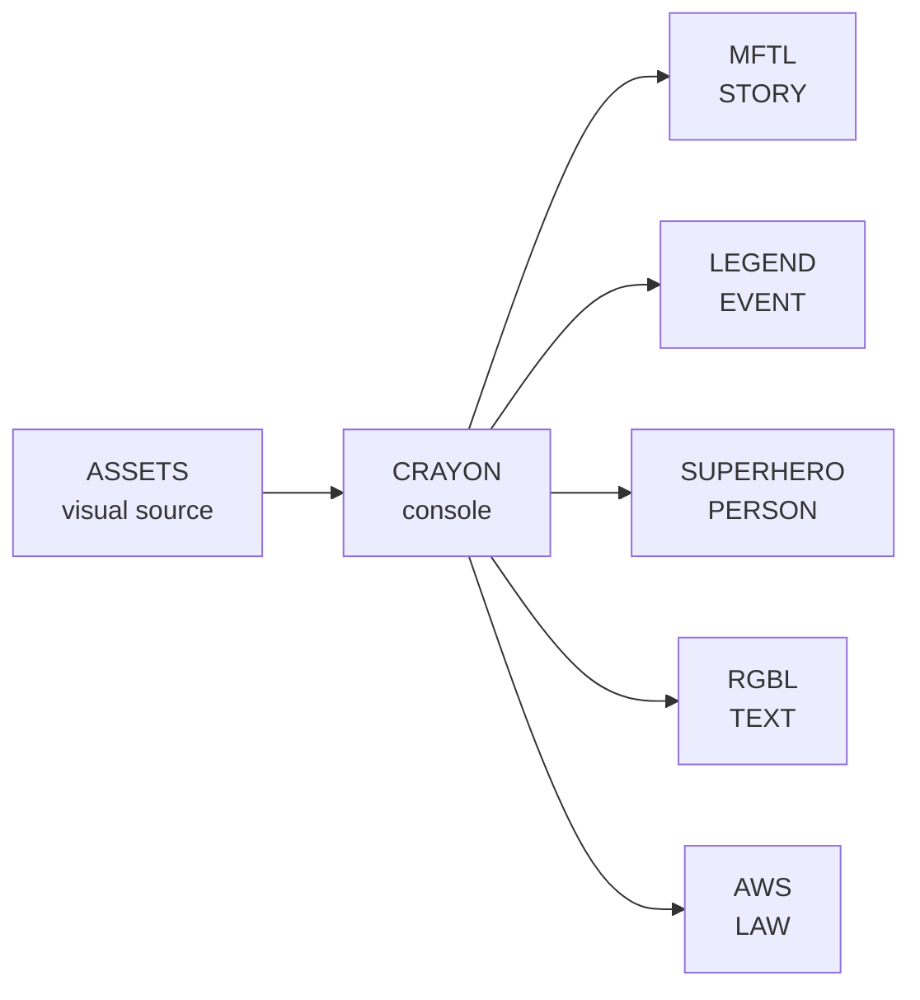
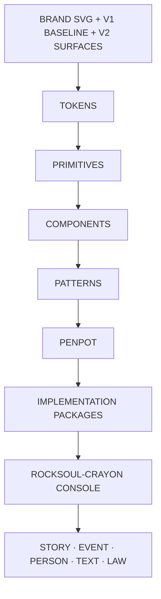

# ROCKSOUL ASSETS

### **VISUAL SOURCE OF TRUTH**

Canonical brand, product-shell, UI, component, token, and design-handoff assets for the **MoonWitness × Rocksoul** ecosystem.

[Brand](moonwitness/brand/README.md) · [Application Shell](docs/APPLICATION-SHELL.md) · [Penpot](penpot/README.md) · [Handoff](docs/PENPOT-HANDOFF.md) · [Release](RELEASE.md)

---

> **MoonWitness watches. Rocksoul follows. The record connects. The law draws the line. The legend stays open.**

This repository stores canonical brand vectors, immutable raster baselines, editable SVG reconstructions, reusable production asset packs, Penpot-ready design tokens, primitives, component contracts, product-shell references, and handoff specifications. **Application source code does not belong here.**

## Ecosystem contract

| Layer | Repository | Ownership |
|---|---|---|
| **DESIGN** | [`rocksoul-assets`](https://github.com/bjo163/rocksoul-assets) | brand · tokens · primitives · components · screen references |
| **CONSOLE** | [`rocksoul-crayon`](https://github.com/bjo163/rocksoul-crayon) | operational shell · AutoMenu · dashboard · workspaces |
| **STORY** | [`rocksoul-mftl`](https://github.com/bjo163/rocksoul-mftl) | narrative / belief intelligence |
| **EVENT** | [`rocksoul-legend`](https://github.com/bjo163/rocksoul-legend) | historical / event intelligence |
| **PERSON** | [`rocksoul-superhero`](https://github.com/bjo163/rocksoul-superhero) | actor / transmission intelligence |
| **TEXT** | [`rocksoul-rgbl`](https://github.com/bjo163/rocksoul-rgbl) | scripture / exact-text intelligence |
| **LAW** | [`rocksoul-aws`](https://github.com/bjo163/rocksoul-aws) | international-law / applicability intelligence |

`rocksoul-assets` defines **how the ecosystem looks**. `rocksoul-crayon` defines **how operators enter and work across it**. The five intelligence repositories remain authoritative for their own domains.

## Release

**Current repository release:** `v1.1.0` — 2026-09-08

Release acceptance covers canonical SVG/raster assets, v1 raster→vector pairing, v2 application surfaces, generated brand delivery formats, reusable asset packs, Penpot package generation/validation, reproducible dependency installation, and CI source contracts. Live Penpot native-component/prototype inspection remains a manual design-workspace verification.

See `RELEASE.md`, `CHANGELOG.md`, and `docs/RELEASE-CHECKLIST.md`.

## Design source of truth

| Concern | Canonical source |
|---|---|
| Design tool | **Penpot** |
| Repository | **`rocksoul-assets`** |
| Brand | `moonwitness/brand/` |
| Immutable visual baseline | `moonwitness/ui/v1/` |
| Application vector surfaces | `moonwitness/ui/v2/` |
| Product icons | `moonwitness/icons/` |
| Dashboard widgets | `moonwitness/dashboard-pack/` |
| Data visualization | `moonwitness/data-viz/` |
| Hero backgrounds | `moonwitness/hero-backgrounds/` |
| System illustrations | `moonwitness/state-illustrations/` |
| Motion references | `moonwitness/motion/` |
| Design-system source | `penpot/` |

The earlier Figma file is retained as prototype/reference only.

## Brand system

Canonical SVG sources include the primary mark, horizontal / stacked / monochrome logos, wordmark, MoonWitness × Rocksoul ecosystem lockup, favicon, pinned-tab icon, app icons, social avatar, and Open Graph card. Raster delivery assets are generated from these canonical SVGs under `moonwitness/brand/generated/`.

## Asset packs

| Pack | Path | Canonical assets |
|---|---|---:|
| Product Icons | `moonwitness/icons/` | 44 SVG icons |
| Dashboard Pack | `moonwitness/dashboard-pack/` | 20 widget SVGs |
| Data-Viz Pack | `moonwitness/data-viz/` | 16 SVG components |
| Hero Backgrounds | `moonwitness/hero-backgrounds/` | 8 vector backgrounds |
| State Illustrations | `moonwitness/state-illustrations/` | 12 SVG illustrations |
| Motion Pack | `moonwitness/motion/` | 6 animated SVG references |
| SFX Pack | `moonwitness/sfx/` | 10 procedural cues + WAV/OGG |

All graphics remain vector-first. SFX is generated reproducibly from `tools/assets/generate-sfx.py`.

## Product surfaces

### Public and design baseline

| Range | Surface | Target |
|---|---|---|
| 01–12 | Observatory, repositories, cases, correlation, legal | public web |
| 13–14 | Community + authentication | community |
| 15 | Internal operations / admin | console/platform |
| 16 | Design-system reference | tokens + UI |

### Console application surfaces

V2 is the implementation reference for the authenticated **Rocksoul Crayon Console**:

| Asset | Console surface |
|---|---|
| `17-dashboard.svg` | Dashboard |
| `18-command-palette.svg` | Command Palette |
| `19-notifications.svg` | Notifications |
| `20-kanban.svg` | Kanban |
| `21-calendar.svg` | Calendar |
| `22-chat.svg` | Chat |
| `23-ai-workspace.svg` | AI Workspace |
| `24-resources.svg` | AutoMenu Resources |
| `25-profile-settings.svg` | Profile / Settings |
| `26-authorization.svg` | Authorization UX |
| `27-system-states.svg` | Error / Empty / Loading states |
| `application-shell.svg` | Shared shell / navigation contract |

## Raster → vector contract

Every PNG/JPEG visual reference in `moonwitness/` must either have a same-basename editable SVG counterpart or be a generated delivery asset whose manifest points to a canonical SVG source. Canonical vector sources may not embed raster images.

The 16 immutable v1 screens have corresponding native SVG reconstructions. Material product expansion belongs in a new version layer; v2 remains vector-first.

## Design pipeline

## Asset contract

- Never commit generator/default filenames.
- Prefix ordered screens with a two-digit sequence.
- Existing `v1` PNG images are immutable visual references.
- PNG screens are composition references, not pixel-perfect implementation contracts.
- Canonical editable assets are SVG; generated raster delivery files are derivatives.
- Penpot is the canonical interactive design layer.
- Tokens and component contracts here are version-controlled implementation sources.
- Resource navigation remains **AutoMenu-driven** in the console.
- Do not place application source code in this repository.

Start with `moonwitness/brand/README.md`, `docs/APPLICATION-SHELL.md`, `penpot/README.md`, and `docs/PENPOT-HANDOFF.md`.

---

### **DESIGN ONCE · TRACE EVERYWHERE**

`MoonWitness × Rocksoul · visual source of truth`

