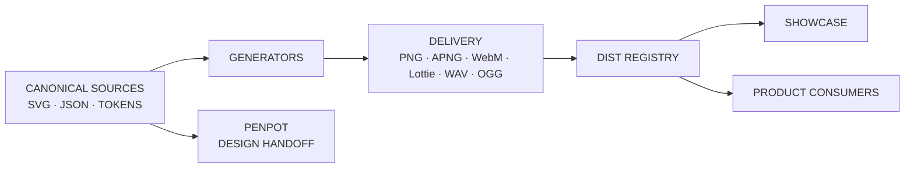
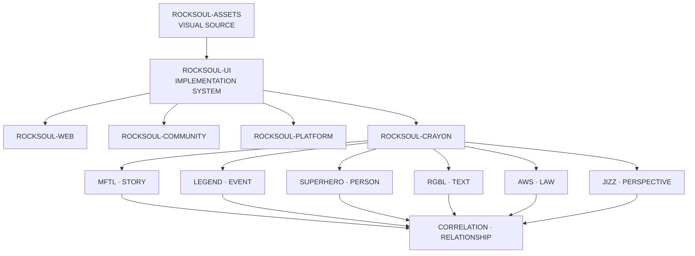

<div align="center">


# Rocksoul Assets

### **The visual source of truth for MoonWitness × Rocksoul**

Canonical brand, UI surfaces, evidence semantics, data visualization, motion, sound, delivery registries, and Penpot handoff assets.

[](https://github.com/bjo163/rocksoul-assets/releases/tag/v1.3.1)
[](https://github.com/bjo163/rocksoul-assets/actions/workflows/validate-assets.yml)
[](https://github.com/bjo163/rocksoul-assets/actions/workflows/release-gate.yml)
[](https://rocksoul-assets-showcase.vercel.app)

**[Live Showcase](https://rocksoul-assets-showcase.vercel.app)** · **[Docs Hub](docs/README.md)** · **[Quick Start](docs/GETTING-STARTED.md)** · **[Asset Catalog](docs/ASSET-PACK-CATALOG.md)** · **[Release](RELEASE.md)**

</div>

---

> **MoonWitness watches. Rocksoul follows. The record connects. The law draws the line. The trail stays inspectable.**

This repository defines **how the MoonWitness × Rocksoul ecosystem looks and communicates**. It is a source-first asset system, not an application repository.

## Current state

| Signal | Current |
|---|---:|
| Release | **v1.3.1** |
| Asset-pack families | **43** |
| Showcase collections | **45** |
| Delivery files indexed in showcase | **1,464 / 1,464** |
| Showcase coverage | **100%** |
| Canonical MoonWitness SVG sources | **634** |
| PNG / APNG delivery files | **777** |
| Runtime motion | **12 SVG + 12 APNG + 12 WebM + 12 Lottie** |
| Product SFX | **14 WAV + 14 OGG** |
| Raster files without vector source | **0** |
| MoonWitness delivery vectors without PNG | **0** |

The current asset-generation scope is **closed and release-complete**. Future visual additions are new scope and must satisfy the same source, delivery, registry, and showcase contracts.

## Start here

Choose the path that matches what you are doing:

| You are… | Start with |
|---|---|
| **Frontend / product engineer** | [Getting Started](docs/GETTING-STARTED.md) → [Asset Consumption](docs/ASSET-CONSUMPTION.md) → `dist/assets.ts` |
| **Designer** | [Visual Language](docs/VISUAL-LANGUAGE-V1.3.md) → [Asset Structure](docs/ASSET-STRUCTURE.md) → [Penpot Handoff](docs/PENPOT-HANDOFF.md) |
| **Maintainer** | [Governance](docs/GOVERNANCE.md) → [Versioning](docs/VERSIONING.md) → [Release Checklist](docs/RELEASE-CHECKLIST.md) |
| **Reviewer / auditor** | [Asset Closure Audit](docs/ASSET-CLOSURE-AUDIT.md) → [Showcase Coverage](docs/SHOWCASE-COVERAGE.md) → [Accessibility](docs/ACCESSIBILITY.md) |
| **Explorer** | [Live Showcase](https://rocksoul-assets-showcase.vercel.app) |

## Use an asset in under a minute

The generated registry is the preferred developer entry point:

```ts
import { assets } from "./dist/assets";

const evidenceBox =
  assets.packs["evidence-media"].svg["bounding-box"];

const supportsEdge =
  assets.packs["correlation-semantics"].svg["edge-supports"];

const verifiedBadge =
  assets.packs["badge-status"].svg.verified;

const researcher64 =
  assets.packs["persona-avatar"].png.researcher["64"];
```

Product icons can also be consumed from the generated SVG sprite:

```html
<svg aria-label="Search">
  <use href="/dist/sprite.svg#mw-search"></use>
</svg>
```

For discovery, use:

- `moonwitness/asset-packs.json` — canonical pack index;
- `dist/assets.json` — complete delivery + showcase registry;
- `dist/assets.ts` — generated TypeScript registry;
- `dist/assets.css` — generated CSS path variables;
- `dist/sprite.svg` — product-icon sprite;
- [Live Showcase](https://rocksoul-assets-showcase.vercel.app) — human exploration of every delivery file.

## Source-of-truth model



| Concern | Canonical source |
|---|---|
| Brand | `moonwitness/brand/` |
| Immutable public visual baseline | `moonwitness/ui/v1/` |
| Authenticated application surfaces | `moonwitness/ui/v2/` |
| Pack discovery | `moonwitness/asset-packs.json` |
| Modular asset packs | `moonwitness/*-pack/` + legacy first-class pack roots |
| Developer distribution | `dist/` — generated, never hand-maintained |
| Penpot design system | `penpot/` |
| Showcase presentation metadata | `showcase/catalog.json` |

**Rule:** canonical design decisions live in source files. Generated delivery files must never become the only source of a visual decision.

## What lives here

The 43 pack families cover:

- **Foundations & core UI** — product icons, dashboard widgets, states, badges, file/source types;
- **Evidence & investigation** — annotation, correlation semantics, geospatial, privacy/redaction, integrity, jurisdiction, export/seals;
- **Workflow** — Kanban, calendar, chat, AI workspace, authorization/security, data grid, forms, commands;
- **Identity & character** — personas, Rocksoul character, theme/accessibility, cursors;
- **Media & communication** — hero backgrounds, cinematic hero, editorial, social, onboarding, notifications, reports, device mockups, texture/material;
- **System delivery** — architecture diagrams, motion, runtime motion, SFX, developer distribution.

See the full machine-readable index at `moonwitness/asset-packs.json` and the human catalog at [docs/ASSET-PACK-CATALOG.md](docs/ASSET-PACK-CATALOG.md).

## Repository map

```text
rocksoul-assets/
├── moonwitness/
│   ├── brand/                 # identity sources + generated delivery
│   ├── ui/v1/                 # immutable baseline SVG/PNG pairs
│   ├── ui/v2/                 # application surfaces + PNG previews
│   ├── icons/                 # product icon system
│   ├── *-pack/                # modular production packs
│   ├── motion/                # animated SVG motion references
│   └── sfx/                   # sound contract + generated audio
├── penpot/                    # design-system and golden-slice sources
├── dist/                      # generated developer registry
├── showcase/                  # public catalog metadata + UI
├── docs/                      # canonical documentation / wiki source
├── tools/                     # generators and validators
└── .github/workflows/         # CI, generation, release gates
```

## Ecosystem boundary

`rocksoul-assets` owns **visual source and delivery contracts**. It does not own application source code or domain intelligence.



Correlation owns cross-domain RELATIONSHIP semantics and explainability metadata. It does **not** duplicate canonical STORY, EVENT, PERSON, TEXT, LAW, or PERSPECTIVE records, and correlation must never visually imply causation by default.

## Delivery guarantees

The repository enforces these invariants in CI:

1. every tracked SVG parses as valid XML;
2. canonical SVGs do not embed raster payloads;
3. every MoonWitness PNG/JPEG maps to a canonical SVG;
4. every MoonWitness delivery SVG has at least one PNG derivative;
5. pack manifests and the global index stay in sync;
6. generated brand, raster, SFX, runtime-motion, and `dist/` output reproduces from source;
7. **1,464 / 1,464 delivery files remain reachable from the showcase registry**;
8. Penpot source/package/golden-slice checks remain valid.

See [Asset Closure Audit](docs/ASSET-CLOSURE-AUDIT.md) and [Showcase Coverage](docs/SHOWCASE-COVERAGE.md).

## Visual-language principles

- evidence and status are never color-only;
- uncertainty stays visible;
- community submission ≠ verified evidence;
- correlation ≠ causation;
- legal analysis ≠ court judgment;
- graphs require semantic text/data equivalents;
- motion requires reduced-motion behavior;
- redaction/privacy assets carry semantic meaning;
- generated files are outputs, not hand-edited sources.

See [Accessibility](docs/ACCESSIBILITY.md) and [Visual Language](docs/VISUAL-LANGUAGE-V1.3.md).

## Penpot boundary

Repository-side sources, contracts, generated Penpot package, and golden-slice validation are complete.

The following remain intentionally **live-workspace checks**, not missing repository assets:

- final font availability/licensing in the live Penpot workspace;
- native reusable Penpot component reconstruction;
- interaction prototype walkthrough;
- keyboard/focus inspection;
- final live contrast/accessibility review.

See [Live Penpot Verification](docs/PENPOT-LIVE-VERIFICATION.md).

## Documentation

The canonical documentation hub is **[docs/README.md](docs/README.md)**. It is intentionally maintained inside the repository so design decisions remain reviewable in Git.

Key references:

- [Getting Started](docs/GETTING-STARTED.md)
- [Architecture](docs/ARCHITECTURE.md)
- [Asset Consumption](docs/ASSET-CONSUMPTION.md)
- [Asset Pack Catalog](docs/ASSET-PACK-CATALOG.md)
- [Governance](docs/GOVERNANCE.md)
- [Versioning](docs/VERSIONING.md)
- [Showcase Operations](docs/SHOWCASE-OPERATIONS.md)
- [Accessibility](docs/ACCESSIBILITY.md)
- [Penpot Handoff](docs/PENPOT-HANDOFF.md)
- [FAQ](docs/FAQ.md)

## Contributing

Read [CONTRIBUTING.md](CONTRIBUTING.md) before adding or changing assets.

A new visual is not complete when the SVG exists. It is complete when its canonical source, required derivatives, manifest/index entries, developer registry, showcase metadata, documentation, and CI all agree.

## Licensing

This public repository currently has **no repository-wide license file**. Public visibility does not by itself grant reuse rights. See [docs/LICENSING.md](docs/LICENSING.md) before redistributing assets outside the Rocksoul ecosystem.

---

<div align="center">

### **DESIGN ONCE · TRACE EVERYWHERE**

**Source-first. Evidence-aware. Inspectable by default.**

[Showcase](https://rocksoul-assets-showcase.vercel.app) · [Docs](docs/README.md) · [Release v1.3.1](https://github.com/bjo163/rocksoul-assets/releases/tag/v1.3.1)

</div>
