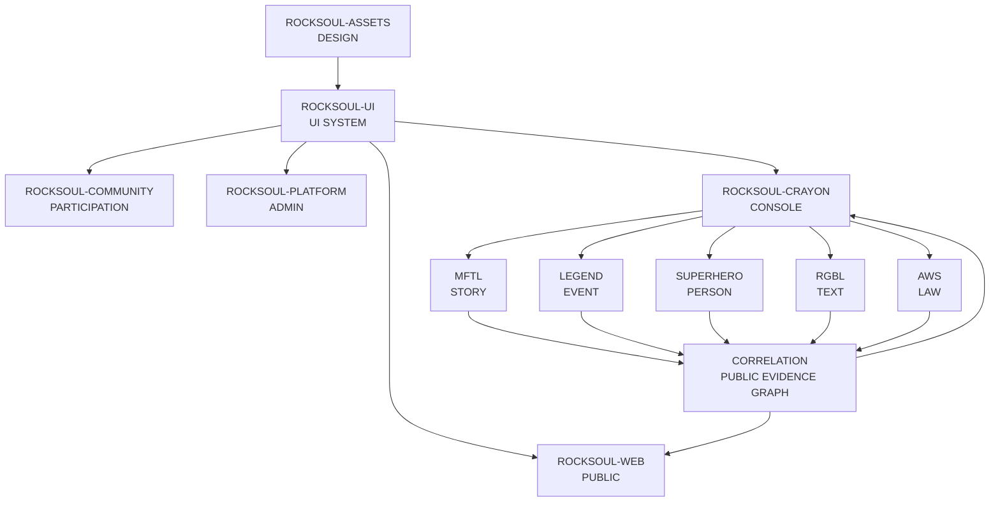
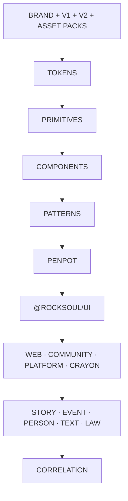

<div align="center">


# ROCKSOUL ASSETS

## **VISUAL SOURCE OF TRUTH**

### **DESIGN ONCE · TRACE EVERYWHERE**

Canonical brand, product-shell, UI, component, token, data-viz, motion, and design-handoff assets for the **MoonWitness × Rocksoul** ecosystem.


[Brand](moonwitness/brand/README.md) · [Application Shell](docs/APPLICATION-SHELL.md) · [Penpot](penpot/README.md) · [Handoff](docs/PENPOT-HANDOFF.md) · [Release](RELEASE.md)

</div>

---

> **MoonWitness watches. Rocksoul follows. The record connects. The law draws the line. The trail stays inspectable.**

`rocksoul-assets` defines **how the ecosystem looks and communicates**. Application source code does not belong here.

## Canonical ecosystem



### Product and experience layers

| Layer | Repository | Responsibility |
|---|---|---|
| **DESIGN** | [`rocksoul-assets`](https://github.com/bjo163/rocksoul-assets) | brand · tokens · screens · icons · data-viz · motion |
| **UI SYSTEM** | [`rocksoul-ui`](https://github.com/bjo163/rocksoul-ui) | reusable production components · patterns · application shell |
| **PUBLIC WEB** | [`rocksoul-web`](https://github.com/bjo163/rocksoul-web) | landing · observatory · repositories · public cases |
| **COMMUNITY** | [`rocksoul-community`](https://github.com/bjo163/rocksoul-community) | participation · identity · discussion · proposals |
| **PLATFORM** | [`rocksoul-platform`](https://github.com/bjo163/rocksoul-platform) | administration · authorization · moderation operations |
| **CONSOLE** | [`rocksoul-crayon`](https://github.com/bjo163/rocksoul-crayon) | operator workspace · AutoMenu · cross-domain research operations |

### Intelligence ownership

| Domain | Repository | Core question |
|---|---|---|
| **STORY** | [`rocksoul-mftl`](https://github.com/bjo163/rocksoul-mftl) | What was told? |
| **EVENT** | [`rocksoul-legend`](https://github.com/bjo163/rocksoul-legend) | What happened? |
| **PERSON** | [`rocksoul-superhero`](https://github.com/bjo163/rocksoul-superhero) | Who was involved? |
| **TEXT** | [`rocksoul-rgbl`](https://github.com/bjo163/rocksoul-rgbl) | What does the exact text say? |
| **LAW** | [`rocksoul-aws`](https://github.com/bjo163/rocksoul-aws) | Was it allowed? |
| **CORRELATION** | [`rocksoul-correlation`](https://github.com/bjo163/rocksoul-correlation) | How do reviewed records relate? |

```text
DESIGN      → ASSETS
CODE UI     → UI
PUBLIC      → WEB
PEOPLE      → COMMUNITY
ADMIN       → PLATFORM
OPS         → CRAYON

STORY       → MFTL
EVENT       → LEGEND
PERSON      → SUPERHERO
TEXT        → RGBL
LAW         → AWS
CORRELATION → CORRELATION
```

Correlation owns cross-domain edges and explainability metadata only. It does not duplicate canonical STORY, EVENT, PERSON, TEXT, or LAW records and it does not become a Mizan verdict layer.

## Design source of truth

| Concern | Canonical source |
|---|---|
| Design tool | **Penpot** |
| Brand | `moonwitness/brand/` |
| Immutable visual baseline | `moonwitness/ui/v1/` |
| Application vector surfaces | `moonwitness/ui/v2/` |
| Product icons | `moonwitness/icons/` |
| Dashboard widgets | `moonwitness/dashboard-pack/` |
| Data visualization | `moonwitness/data-viz/` |
| Hero backgrounds | `moonwitness/hero-backgrounds/` |
| System illustrations | `moonwitness/state-illustrations/` |
| Motion references | `moonwitness/motion/` |
| Design-system source | `penpot/` |

The earlier Figma file remains prototype/reference only.

## Brand system

<div align="center">


</div>

Canonical SVG sources cover the primary mark, horizontal / stacked / monochrome logos, wordmark, ecosystem lockup, favicon, pinned-tab icon, app icons, social avatar, and Open Graph card. Raster delivery assets are derivatives generated from canonical vectors.

## Asset packs

| Pack | Path | Canonical assets |
|---|---|---:|
| Product Icons | `moonwitness/icons/` | 44 SVG icons |
| Dashboard Pack | `moonwitness/dashboard-pack/` | 20 widget SVGs |
| Data-Viz Pack | `moonwitness/data-viz/` | 16 SVG components |
| Hero Backgrounds | `moonwitness/hero-backgrounds/` | 8 vector backgrounds |
| State Illustrations | `moonwitness/state-illustrations/` | 12 SVG illustrations |
| Motion Pack | `moonwitness/motion/` | 6 animated SVG references |
| SFX Pack | `moonwitness/sfx/` | 10 procedural cues + WAV/OGG |

Correlation visualizations should preferentially use the existing **node-link, provenance, evidence-matrix, timeline, repository-health, metric, annotation, and edge-style** assets in `moonwitness/data-viz/`.

## Surface ownership

| Range | Canonical surface | Primary repository |
|---|---|---|
| **01–12** | Public observatory, repositories, cases, correlation, legal | `rocksoul-web` |
| **13–14** | Community + authentication | `rocksoul-community` |
| **15** | Internal platform/admin | `rocksoul-platform` |
| **16** | Design-system reference | `rocksoul-ui` |
| **17–27** | Authenticated shell + workspaces | `rocksoul-crayon` / shared UI |

V2 defines Dashboard, Command Palette, Notifications, Kanban, Calendar, Chat, AI Workspace, Resources/AutoMenu, Profile/Settings, Authorization UX, system states, and the shared application shell.

<div align="center">


</div>

## Visual language contract

Across every Rocksoul repository:

- **MoonWitness** is the product umbrella;
- **Rocksoul** is the connective character/thread;
- repository landing pages use the canonical MoonWitness logo and Rocksoul lockup;
- headings are short, declarative, and domain-specific;
- badges communicate role, not decoration;
- evidence/status must remain readable in expressive surfaces;
- status is never color-only;
- graphs require a text equivalent;
- uncertainty is represented, not hidden;
- correlation must never visually imply causation by default;
- application code consumes `@rocksoul/ui` rather than recreating the design system;
- changes to brand grammar start here before propagating downstream.

## Design pipeline



## Asset contract

- Existing `v1` PNG images remain immutable visual references.
- Canonical editable graphics are SVG; raster delivery files are derivatives.
- Material visual expansion goes to a new version layer rather than rewriting the baseline.
- Penpot is the canonical interactive design layer.
- Resource navigation remains AutoMenu-driven where applicable.
- Do not place application source code in this repository.

Start with `moonwitness/brand/README.md`, `docs/APPLICATION-SHELL.md`, `penpot/README.md`, and `docs/PENPOT-HANDOFF.md`.

---

<div align="center">

## **DESIGN ONCE · TRACE EVERYWHERE**

### **ONE LANGUAGE · TWELVE REPOSITORIES · FIVE SOURCE DOMAINS · ONE PUBLIC CORRELATION LAYER**

`ASSETS / MoonWitness × Rocksoul`

</div>
