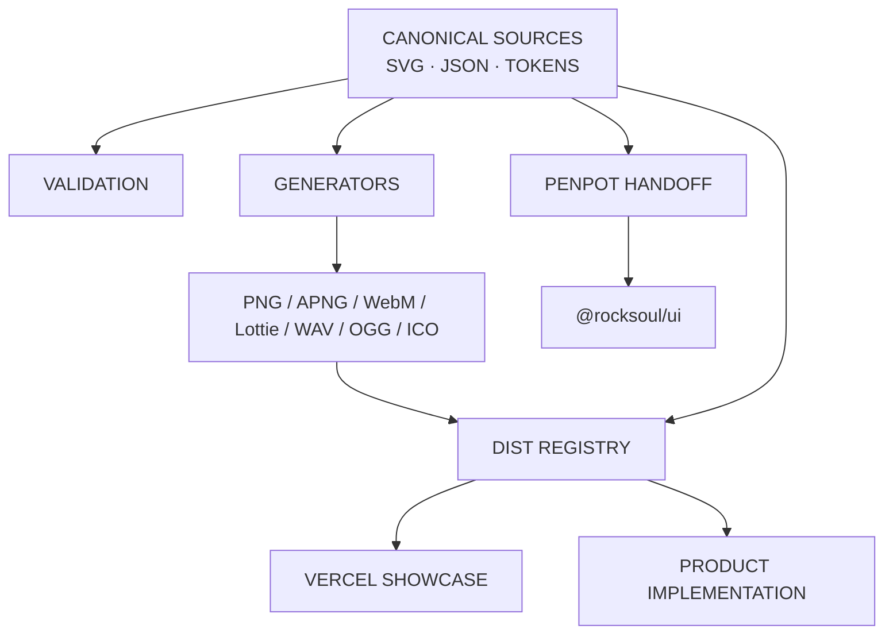

# Asset-System Architecture

`rocksoul-assets` is a **source-first visual delivery system**.

Its job is not merely to store images. It maintains traceability from visual intent to canonical source, generated delivery, developer registry, public showcase, and downstream implementation.

## Layer model

## Canonical layers

### Brand

`moonwitness/brand/`

Identity, app icons, social/Open Graph source, and ecosystem lockup.

### Visual baselines

- `moonwitness/ui/v1/` — immutable public visual baseline;
- `moonwitness/ui/v2/` — authenticated application surfaces.

### Modular packs

Pack manifests define count, canonical format, raster requirements, and source root.

Global discovery lives in:

`moonwitness/asset-packs.json`

### Penpot

`penpot/` is the design-workspace source layer: tokens, primitives, components, patterns, screens, and golden-case inputs.

## Generated layers

Generated files must be reproducible and must not be hand-maintained.

- `moonwitness/**/png/`
- `moonwitness/brand/generated/`
- `moonwitness/runtime-motion-pack/{png,webm,lottie}/`
- `moonwitness/sfx/generated/`
- `dist/`

## Developer distribution

`dist/assets.json` is both a delivery registry and showcase registry.

It includes:

- 43 pack families;
- Brand System foundation collection;
- V1 Baseline foundation collection;
- format-specific paths;
- complete delivery-file coverage metadata.

`dist/assets.ts` provides the same registry for typed application consumption.

`dist/sprite.svg` provides the product icon symbol sheet.

## Showcase architecture

The showcase is intentionally static.

Vercel serves:

- `index.html`
- `showcase/showcase.css`
- `showcase/showcase.js`
- `showcase/catalog.json`
- `dist/assets.json`

Canonical binaries resolve from GitHub `main`. This keeps the deployed frontend small while Git remains the visual source of truth.

See [Showcase Operations](SHOWCASE-OPERATIONS.md).

## Validation architecture

The repository uses multiple gates because “valid file” and “valid asset system” are different questions.

### Structural

- every SVG parses as XML;
- no forbidden raster embedding in canonical SVG.

### Traceability

- every raster maps to canonical SVG;
- every MoonWitness delivery SVG has PNG coverage.

### Reproducibility

- brand;
- modular PNG packs;
- SFX;
- runtime APNG/Lottie;
- WebM semantic properties;
- developer distribution.

### Registry / showcase

Every delivery file must be indexed. A missing showcase path fails CI.

### Penpot

Source contracts, generated package, package structure, and golden-slice boards are validated separately.

## Downstream ownership

`rocksoul-assets` defines visual language and asset delivery.

`rocksoul-ui` owns production component implementation.

Public/community/admin/console repositories consume the implementation system rather than recreating visual grammar independently.

Domain repositories own their canonical data and intelligence, not separate visual frontends.
