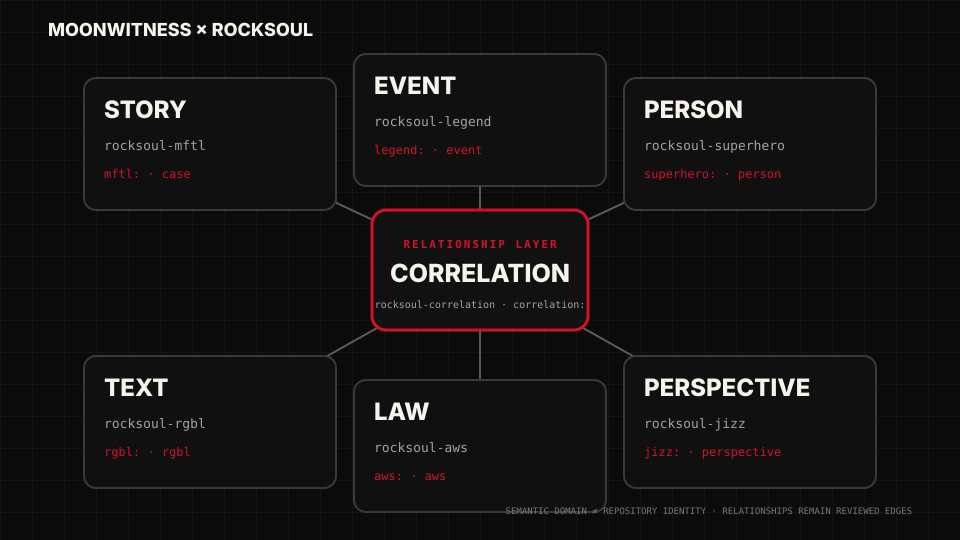

# Asset Consumption Contract — v1.3.1

MoonWitness packs are shipped as **individual consumable assets**, never as required runtime poster slices.

## Preferred entry point

Use `dist/assets.ts` or `dist/assets.json` when application code can consume generated registries. Use `moonwitness/asset-packs.json` for pack discovery. Use the [Live Showcase](https://rocksoul-assets-showcase.vercel.app) when discovering assets visually.

## Registry model

`dist/assets.json` schema v2 exposes:

- 42 indexed asset-pack families;
- 2 foundation collections: Brand System + V1 Baseline Screens;
- per-format paths for SVG, PNG/APNG, ICO, WebM, WAV, OGG, and Lottie;
- coverage metadata proving every delivery file is indexed.

Foundation collections are available under `assets.collections`; indexed packs remain under `assets.packs`.

## Format priority

1. **SVG** — preferred for product UI, diagrams, graphs, badges, evidence overlays, controls and illustrations.
2. **PNG** — email, social, raster-only SDKs, thumbnails and fixed delivery.
3. **APNG / WebM / Lottie** — runtime motion where animation is supported.
4. **WAV / OGG** — SFX according to platform needs.

## Rules

- Never crop or slice an atlas at runtime.
- Never edit generated derivatives directly.
- Status and confidence may not rely on color alone.
- Correlation visuals may not imply causation by default.
- Graphs require accessible text/data equivalents.
- Motion must provide reduced-motion behavior.
- Redaction and privacy assets are semantic controls, not decoration.
- Jurisdiction assets are data-driven; flags are not the canonical legal-state vocabulary.
- Use the smallest adequate persona/character raster derivative.

## Examples

```ts
import { assets } from "./dist/assets";

const verified = assets.packs["badge-status"].svg.verified;
const evidenceBox = assets.packs["evidence-media"].svg["bounding-box"];
const supportsEdge = assets.packs["correlation-semantics"].svg["edge-supports"];
const researcher64 = assets.packs["persona-avatar"].png.researcher["64"];
```

```html
<svg aria-label="Search">
  <use href="/dist/sprite.svg#mw-search"></use>
</svg>
```

Generated files are reproducible via `tools/assets/render-packs.py`, `tools/assets/generate-runtime-motion.py`, and `tools/assets/build-dist.mjs`.

The showcase is not a curated subset: `tools/assets/validate-showcase-coverage.mjs` requires **100% delivery-file coverage**.

See [Getting Started](GETTING-STARTED.md) for the shortest implementation path.


## PERSON identity vs persona roles

Canonical historical or research-domain **PERSON records must use the generic PERSON product icon**:

```text
moonwitness/icons/svg/navigation/person.svg
```

Persona avatars such as `researcher`, `analyst`, `moderator`, `admin`, or `protected-witness` describe **application/user roles**. They must not be assigned to historical people merely because a record is attested, anonymous, disputed, or under review.

Consumer rule:

```text
historical PERSON / unknown identity / archaeological remains
  → product-icons/person + textual identity-status badge

application actor / current workspace role
  → persona-avatar/<role>
```

Status and uncertainty remain textual/semantic and must never be inferred from the avatar artwork.


## Research-domain ownership visual

The six canonical research domains and the reviewed relationship layer are visualized from the machine-readable contract in `moonwitness/ui/v2/research-domains.json`.



The SVG is generated by `tools/assets/generate-domain-ownership-visual.mjs`; CI rejects drift between the JSON ownership contract and the committed visual. Consumers should read ownership from the JSON/UI contract rather than parsing labels from the SVG.
