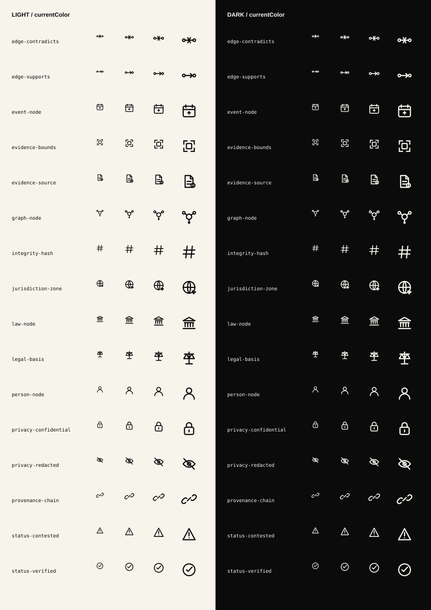

# Semantic Primitives

The production primitive surface is intentionally separate from specimen and
screen-reference artwork. `moonwitness/semantic-primitives-pack/svg` contains
transparent, label-free 24px vectors using `currentColor`; generated PNGs are
rendered at 16, 20, 24, and 32px for optical-size review.

The production sprite contains the 44 product icons plus these 16 semantic
primitives. Specimen packs are excluded from the sprite and must not be used as
runtime icon slots.

Run `node tools/assets/validate-primitives.mjs` to enforce the 24px grid,
theme behavior, no embedded labels, sprite membership, and optical-size
coverage.
